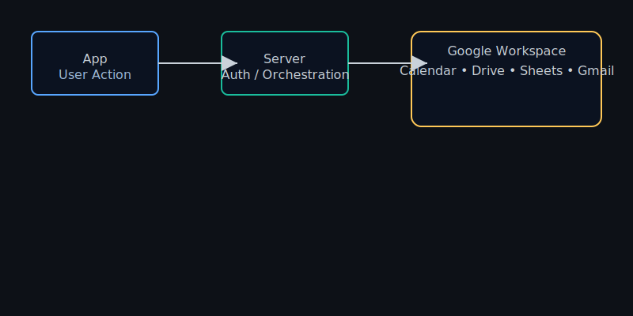

# Google Workflow Example — Race Car Brain

This page outlines a single end-to-end example to spotlight how Google Workspace and the app operate as a coordinated, optimized flow — what we call the "race car brain".

Scenario: Morning Routine (Family)

1. A family admin schedules or sets up a "Morning routine" in the app UI.
2. The app creates a Calendar event on the family-shared Calendar via the server endpoint (`/api/google/calendar/create`) — this ensures everyone has a synchronized reminder.
3. The app uploads a step-by-step SOP (standard operating procedure) to Google Drive in a `SOP: Morning Routine` Doc using the Drive API. The resulting document is linked to the Calendar event and appended to a weekly review sheet for retrospectives.
4. If the routine has delegated responsibilities (e.g., "Willow: Pack lunch"), the app sends a templated email using the Gmail API or a delegated mail-sending service via the server.
5. The app collects usage stats and writes key performance indicators (KPI) to a Sheet for weekly analytics and growth (e.g., % of routines completed), enabling a leader-board view.

Key integrations

- Google Calendar: Reminder scheduling & invite management
- Google Drive: SOP storage & versioning
- Google Sheets: Weekly review analytics
- Gmail: Templated task delegation

Race Car Brain Design Principles

- Low-latency server orchestration: Keep the heavy lifting server-side for credentials and audit logging
- Deterministic state: Use `userReducer` to ensure deterministic local state updates followed by server propagation
- Idempotency & retry: Ensure creation calls are idempotent (e.g., detect existing SOP doc or event by a unique hash)
- Minimal privilege: Use a service account with least privileges for automation; fall back to user OAuth for user-scoped actions
- Telemetry & visibility: Log actions to metrics (prom-client or Cloud Monitoring) and surface actionable errors in Sentry or similar tools

Try the flow locally

1. Add service account JSON to `GOOGLE_SERVICE_ACCOUNT_KEY_JSON` env var (avoid checking secrets into the repo)
2. Add the sample spreadsheet id to `GOOGLE_SAMPLE_SPREADSHEET_ID` and optionally calendar id to `GOOGLE_SAMPLE_CALENDAR_ID`
3. Run `node server/googleWorkspaceRoutes.js` (server has to be running and mounted) and run `npm run dev` to interact with the UI
4. Open the Showcase module to trigger the demo and watch the sim manifest in your console with example outputs

- The demo endpoint (`/api/google/demo`) will prefer an authenticated user OAuth token (if you signed in) and will show real user events. If you haven't signed in or tokens are unavailable, it falls back to a service account (if configured) or returns a mock sample.

OAuth sign-in (user-level)

1. Create OAuth Client Credentials in Google Cloud Console for a Web app. Set the redirect URI to `http://localhost:8080/api/google/oauth2callback` (or your server host) and set authorized origins.
2. Set environment variables `GOOGLE_CLIENT_ID` and `GOOGLE_CLIENT_SECRET` on the server. Optionally set `GOOGLE_OAUTH_REDIRECT_URI` if you use a different redirect URI.
3. Start the server with `npm run start:server` and open the app. Click "Sign in with Google" in the Showcase module to start the OAuth flow.
4. After signing in the server sets a cookie and the server routes use your stored OAuth tokens when interacting with Drive/Calendar/Sheets/Gmail on behalf of the authenticated user.

This README aims to help audit reviewers, developers, and search engines understand the app's orchestration when integrated with Google Workspace.
